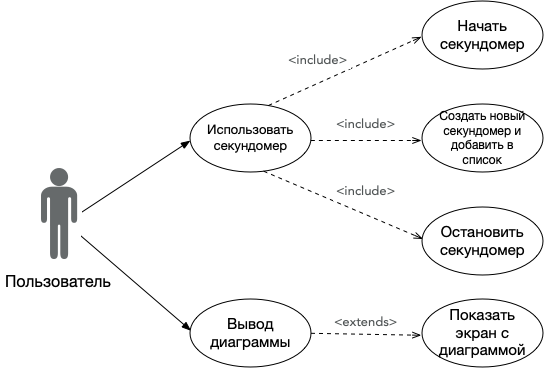

# Диаграмма вариантов использования

# Содержание

1. [Актёры](#1)  
2. [Варианты использования](#2)  
    2.1. [Добавить секундомер](#2.1)  
      2.1.1 [Начать секундомер](#2.1.1)  
      2.1.2 [Создать новый секундомер](#2.1.2)  
      2.1.3 [Остановить секундомер](#2.1.3)  
    2.2. [Вывести дианрамму](#2.2)      
        
 <a name="1"/>
 
 # 1 Актёры
 
| Актёр | Описание |
|:---|:---|
| Пользователь | Пользователь, который может использовать весь функционал приложения |

<a name="2"/>

# 2 Варианты использования

<a name="2.1"/>

## 2.1 Добавить секундомер

<a name="2.1.1"/>

### 2.1.1 Начать секундомер
1. Перед пользователем представлено главное окно с уже добавленными секундомерами.
2. Пользователь нажимает на секундомер.
3. Цифры секундомера начинают отсчитывать время.
4. Полоса прогресса начинает увеличиваться.
5. Вариант использования завершается.

<a name="2.1.2"/>

### 2.1.2 Создать новый секундомер
1. Перед пользователем представлено главное окно.
2. Пользователь вводит название секундомера в поле ввода.
3. Пользователь нажимает кнопку добавления секундомера.
4. Вариант использования завершается.

<a name="2.1.3"/>

### 2.1.3 Остановить секундомер
1. Перед пользователем представлено главное окно с уже запущеным секундомером.
2. Пользователь нажимает на текущий секундомер или на любой другой.
3. Вариант использования завершается.

<a name="2.2"/>

## 2.2 Вывести дианрамму
1. Перед пользователем представлено главное окно.
2. Пользователь нажимает кнопку вывода дианраммы.
3. Появляется окно с диаграммой.
3. Вариант использования завершается.
