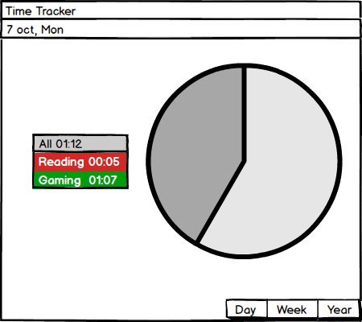

# Требования к проекту
---

# Содержание
1 [Введение](#intro)  
1.1 [Назначение](#appointment)  
1.2 [Бизнес-требования](#business_requirements)  
1.2.1 [Исходные данные](#initial_data)  
1.2.2 [Возможности бизнеса](#business_opportunities)  
1.3 [Аналоги](#analogues)  
2 [Требования пользователя](#user_requirements)  
2.1 [Программные интерфейсы](#software_interfaces)  
2.2 [Интерфейс пользователя](#user_interface)  
2.3 [Характеристики пользователей](#user_specifications)  
2.3.1 [Классы пользователей](#user_classes)  
2.3.2 [Аудитория приложения](#application_audience)  
2.3.2.1 [Целевая аудитория](#target_audience)  
2.3.2.1 [Побочная аудитория](#collateral_audience)  
2.4 [Предположения и зависимости](#assumptions_and_dependencies)  
3 [Системные требования](#system_requirements)  
3.1 [Функциональные требования](#functional_requirements)  
3.1.1 [Основные функции](#main_functions)  
3.1.1.1 [Вход пользователя в приложение](#enter_to_app)  
3.1.1.2 [Отобпожение всех уже добавленых задач](#displays_all_tasks_already_added)  
3.1.1.3 [Просмотр дианраммы за период времени](#view_diagrams_for_a_time_period)  
3.1.2 [Ограничения и исключения](#restrictions_and_exclusions)  
3.2 [Нефункциональные требования](#non-functional_requirements)  
3.2.1 [Атрибуты качества](#quality_attributes)  
3.2.1.1 [Требования к удобству использования](#requirements_for_ease_of_use)  
3.2.2 [Внешние интерфейсы](#external_interfaces)  
3.2.3 [Ограничения](#restrictions)  

<a name="intro"/>

# 1 Введение

<a name="appointment"/>

## 1.1 Назначение
В этом документе описаны функциональные и нефункциональные требования к приложению «Time Tracker» для ОС Mac OS. Этот документ предназначен для команды, которая будет реализовывать и проверять корректность работы приложения. 

<a name="business_requirements"/>

## 1.2 Бизнес-требования

<a name="initial_data"/>

### 1.2.1 Исходные данные
Большинство льюдей думают что рационально используют время в течении дня. На деле же получается,что многие не замечают как много времени они теряют делая ненужные вещи. Например: переписываются с друзьями в соцсетях, играют в игры, посещают развлекательные ресурсы, делают покупки в интернет-магазинах и т.д. В течении дня бесполезное время насчитывает больше чем несколько часов, за неделю набирается в десятки часов, за месяц в дни. В итоге люди начинают жаловаться за недостаток времени, на работе не успевают делать работу в сроки. Вроде человек занимался в течении дня полезныит делами, но в итоге ничего не успел.                                                                            
<a name="business_opportunities"/>

### 1.2.2 Возможности бизнеса
Многие люди желают иметь приложение, которое позволит получать информацию о проделаных делах в течении дня. Подобное приложение позволит им тратить меньше времени на бесполезные дела. Интерфейс позволит быстро оценить проделаную работу за день(месяц, год). Также позволит скоректировать дальнейшие планы с учетом проделанной работы. И в итоге видеть на графиках продуктивный день и в последствии отводить время на отдых и развлечения.

<a name="analogues"/>

## 1.3 Аналоги
Обзор аналогов представлен в документе [**Overview of analogues**](Overview%20of%20analogues.md)

<a name="user_requirements"/>

# 2 Требования пользователя

<a name="software_interfaces"/>

## 2.1 Программные интерфейсы
Будет использована JavaFX — платформа на основе Java для создания приложений с насыщенным графическим интерфейсом.

<a name="user_interface"/>

## 2.2 Интерфейс пользователя
Окно входа в приложение. Без введенных задач.    
 
 
Окно добавления новой задачи.    
 
 
Окно где начался отсчет задачи.    
 
 
Окно где начался отсчет второй задачи.    
 
 
Окно с отоброжением всей информации при помоши круговой диаграммы.    
  

<a name="user_specifications"/>

## 2.3 Характеристики пользователей

<a name="user_classes"/>

### 2.3.1 Классы пользователей

| Класс пользователей | Описание |
|:---|:---|
| Анонимные пользователи | Все пользователи. Имеют доступ ко всему функцоналу |

<a name="application_audience"/>

### 2.3.2 Аудитория приложения

<a name="target_audience"/>

#### 2.3.2.1 Целевая аудитория
Люди любой возрастной категории со средним или выше среднего уровнем образования, обладающие минимальной технической грамотностью.

<a name="collateral_audience"/>

#### 2.3.2.2 Побочная аудитория
Пользователи любой котегории. В основном студенты.

<a name="assumptions_and_dependencies"/>

## 2.4 Предположения и зависимости
1. Приложение будет работает при отсутствии подключения к Интернету;

<a name="system_requirements"/>

# 3 Системные требования

<a name="functional_requirements"/>

## 3.1 Функциональные требования

<a name="main_functions"/>

### 3.1.1 Основные функции

<a name="enter_to_app"/>

#### 3.1.1.1 Вход пользователя в приложение
**Описание.** Пользователь имеет возможность использовать приложение без создания собственного профиля.

| Функция | Требования | 
|:---|:---|
| Вход в приложение без создания собственного профиля | Приложение должно предоставить пользователю возможность войти в приложение анонимно |

<a name="displays_all_tasks_already_added"/>

#### 3.1.1.2 Отобпожение всех уже добавленых задач
**Описание.** После входа пользователя в приложение отображается список всех уже добавленых задачь. Если пользователь уже входил в этот день, то должно отображаться еще и все предыдущие таймеры за этот день. 

| Функция | Требования | 
|:---|:---|
| Загрузка задач | После входа пользователя в приложение отображается список задачь с таймерами |

<a name="view_diagrams_for_a_time_period"/>

#### 3.1.1.3 Просмотр дианраммы за период времени
**Описание.** Пользователь имеет возможность просмотреть информацию за день, неделю, месяц, год.

| Функция | Требования | 
|:---|:---|
| Просмотр информации по груговой дианрамме | Пользователь имеет возможность изменять отображаемую информацию на круговой дианрамме(день, неделя, месяц, год) |

<a name="active_user_change"/>

### 3.1.2 Ограничения и исключения
1. Нет возможности просмотра данных в опеделенный день;
2. Приложение не предоставляет возможность защиты информации от других пользователей.

<a name="non-functional_requirements"/>

## 3.2 Нефункциональные требования

<a name="quality_attributes"/>

### 3.2.1 Атрибуты качества

<a name="requirements_for_ease_of_use"/>

#### 3.2.1.1 Требования к удобству использования
1. Доступ к основным функциям приложения не более чем за одну операцию;
2. Все функциональные элементы пользовательского интерфейса имеют названия, описывающие действие, которое произойдет при выборе элемента;
3. Пошаговая инструкция использования основных функций приложения отображена в справке;

<a name="external_interfaces"/>

### 3.2.2 Внешние интерфейсы
Окно приложения маленькое и не будет занимать много места на рабочем столе.

<a name="restrictions"/>

### 3.2.3 Ограничения
1. Нет профиля пользователя.
